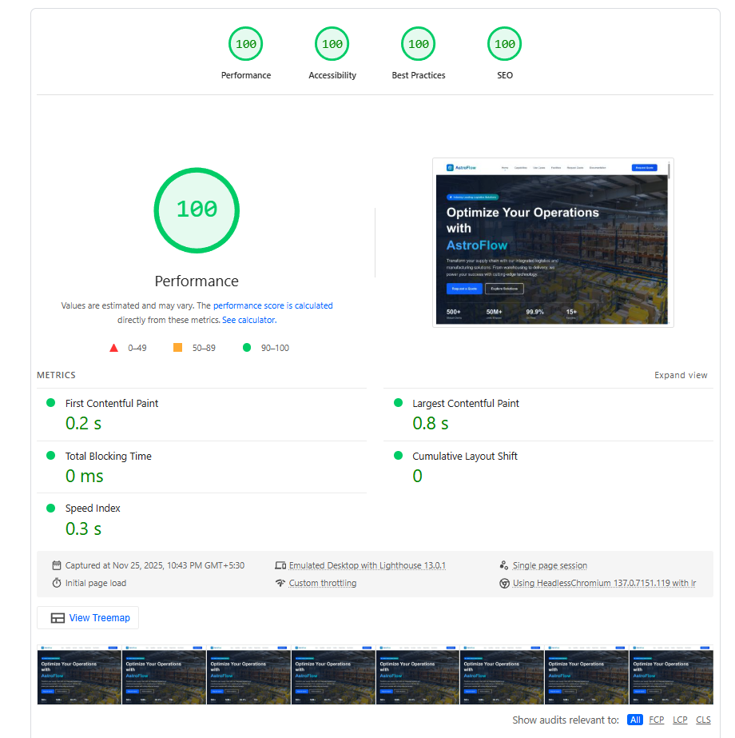

# AstroFlow - Logistics & Manufacturing Website Template

A modern, professional Astro.js template for logistics, manufacturing, and supply chain companies. Built with React, Tailwind CSS, and TypeScript.


## 🖼️ Preview

### Website Screenshot


### Performance & Speed


## ✨ Features

- 🚀 **Built with Astro** - Fast, modern static site generation
- ⚛️ **React Components** - Interactive components with React
- 🎨 **Tailwind CSS 4** - Modern utility-first styling
- 📱 **Fully Responsive** - Mobile-first design
- ♿ **Accessible** - Built with accessibility in mind
- 🎯 **SEO Optimized** - Meta tags and semantic HTML
- 🎭 **Smooth Animations** - Powered by Motion library
- 🎨 **Modern UI** - Beautiful gradient designs and components

## 📦 Pages Included

- **Home** - Hero section, features, stats, testimonials
- **Capabilities** - Service offerings showcase
- **Use Cases** - Industry-specific solutions
- **Facilities** - Location and facility information
- **Request Quote (RFQ)** - Contact form for quotes
- **Documentation** - Resources and guides

## 🚀 Quick Start

### Prerequisites

- Node.js 18+ and npm

### Installation

1. Clone this repository:
```bash
git clone https://github.com/yourusername/astroflow.git
cd astroflow
```

2. Install dependencies:
```bash
npm install
```

3. Start the development server:
```bash
npm run dev
```

4. Open [http://localhost:4321](http://localhost:4321) in your browser

## 📝 Configuration

### Site Configuration

Update `src/config/site.ts` with your information:

```typescript
export const SITE = {
  title: 'Your Company Name', // TODO: Replace with your company name
  description: 'Your company description', // TODO: Update with your description
  url: 'https://yourdomain.com', // TODO: Replace with your actual domain
  author: 'Your Company Name', // TODO: Replace with your company name
} as const;

export const SOCIAL_LINKS = {
  linkedin: 'https://linkedin.com/company/yourcompany', // TODO: Replace with your LinkedIn
  twitter: 'https://twitter.com/yourcompany', // TODO: Replace with your Twitter
  facebook: 'https://facebook.com/yourcompany', // TODO: Replace with your Facebook
} as const;
```

### Form Integration

The RFQ form (`src/components/react/RFQForm.tsx`) currently logs form data to the console. To integrate with a backend:

1. **Option 1: Form Service** (Recommended for static sites)
   - Use [Formspree](https://formspree.io/), [Netlify Forms](https://www.netlify.com/products/forms/), or similar
   - Update the `handleSubmit` function in `RFQForm.tsx`

2. **Option 2: Custom API**
   - Create an API endpoint
   - Update the form submission handler

Example with Formspree:
```typescript
const handleSubmit = async (e: React.FormEvent<HTMLFormElement>) => {
  e.preventDefault();
  const formData = new FormData(e.currentTarget);
  
  const response = await fetch('https://formspree.io/f/YOUR_FORM_ID', {
    method: 'POST',
    body: formData,
    headers: { 'Accept': 'application/json' }
  });
  
  if (response.ok) {
    // Show success message
  }
};
```

## 🛠️ Available Scripts

| Command                | Action                                           |
| :--------------------- | :----------------------------------------------- |
| `npm install`          | Installs dependencies                            |
| `npm run dev`          | Starts local dev server at `localhost:4321`     |
| `npm run build`        | Build your production site to `./dist/`         |
| `npm run preview`      | Preview your build locally, before deploying     |
| `npm run astro ...`    | Run CLI commands like `astro add`, `astro check` |

## 📁 Project Structure

```
/
├── public/
│   └── favicon.svg
├── src/
│   ├── assets/          # Images and static assets
│   ├── components/      # Reusable components
│   │   ├── home/        # Home page components
│   │   ├── react/       # React interactive components
│   │   └── ui/          # UI components
│   ├── config/          # Configuration files
│   ├── layouts/         # Page layouts
│   ├── pages/           # Astro pages (routes)
│   ├── styles/          # Global styles
│   └── utils/           # Utility functions
├── astro.config.mjs     # Astro configuration
├── package.json
└── tsconfig.json
```

## 🎨 Customization

### Colors

The template uses Tailwind CSS. Customize colors in `src/styles/global.css` or update Tailwind config.

### Images

Replace placeholder images in `src/assets/` with your own. The template includes stock photos as placeholders.

### Content

- Update text content in component files
- Modify navigation in `src/config/site.ts`
- Update facility information in `src/pages/facilities.astro`
- Customize testimonials in `src/components/home/Testimonials.astro`

## 🚢 Deployment

### Build for Production

```bash
npm run build
```

This creates a `dist/` folder with your static site.

### Deploy to Vercel

[](https://vercel.com/new/clone?repository-url=https://github.com/yourusername/astroflow)

### Deploy to Netlify

[](https://app.netlify.com/start/deploy?repository=https://github.com/yourusername/astroflow)

### Other Platforms

The `dist/` folder can be deployed to any static hosting service:
- GitHub Pages
- Cloudflare Pages
- AWS S3 + CloudFront
- Any static hosting provider

## 📄 License

This project is licensed under the MIT License - see the [LICENSE](LICENSE) file for details.


## 🤝 Contributing

Contributions, issues, and feature requests are welcome! Feel free to check the [issues page](https://github.com/yourusername/astroflow/issues).

## ⭐ Show Your Support

If you find this template useful, please give it a star on GitHub!

## 📧 Support

For questions or support, please open an issue on GitHub.

---

Built with ❤️ using [Astro](https://astro.build)
